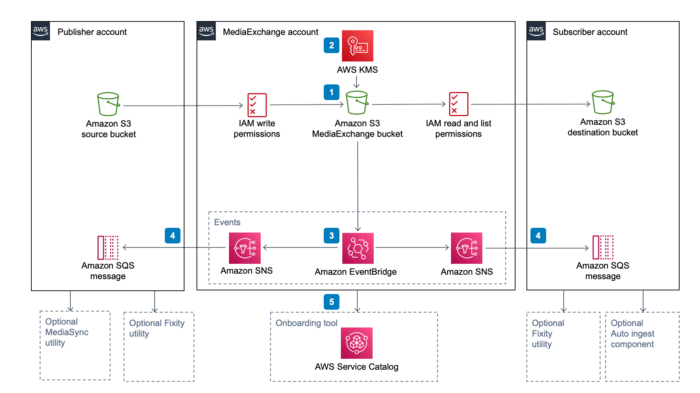
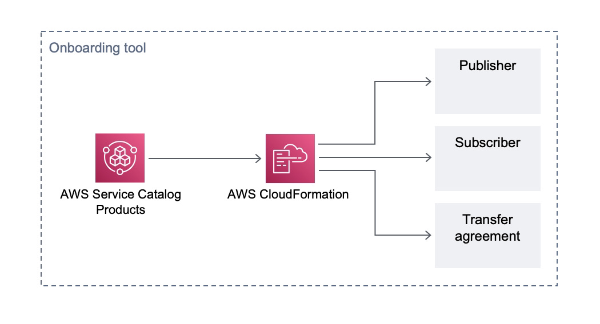

## Media Exchange On AWS

Traditional file transfer services for Media supply chain are expensive, can add unnecessary hours to a workflow making quick-turn challenging, and not optimized for in-cloud media ecosystems. AWS Customers and ISV Partners can now take advantage of utilizing AWS as a common media storage foundation to create direct hand-offs within the ecosystem. Using this new Solution, called Media Exchange On AWS, AWS Customers and ISV Partners can ensure optimal quality, sustain a consistent understanding of the asset state and confirm asset receipt. The goal of this project is to re-examine media supply-chain with cloud-optimizations in mind, and define an asset transfer solution that can be deployed with CloudFormation templates.

## What is Media Exchange

The Media Exchange Solution puts a shared object store (S3 bucket) between publishers and subscribers in a separate, secured AWS account. Publishers copy the assets into this shared storage area and create permissions so that the receivers can pull the content from the S3 bucket. The assets do not leave the S3 data plane in this process, thereby (a) there are no per/GB data egress and transfer costs within the same region, (b) eliminates egress, schedule and delivery time dependencies, (c) extremely fast and (d) no servers to manage. The assets are secure by default, encrypted at rest and in transit.
In the standard deployment model, assets are stored in Media Exchange only for the purposes for transfer. This works like a temporary custodian that does not have read/write permissions to the assets shared through it. Each publisher-subscriber transfer relationship gets its own S3 bucket to share assets. Publishers have write permissions to this bucket, a subscriber can only view assets under their assigned bucket and import assets that are shared to them. Publishers and subscribers perform these operations from their respective AWS accounts that they have on-boarded with into Media Exchange. The primary benefit of this process is that there are no credentials to share between Publishers and Subscribers. All operations on the assets are tracked via AWS CloudTrail and S3 logs. The assets shared in the Media Exchange account are lifecycle deleted after a Publisher-defined period.
This is a seamless addition to the current workflow for your customers who use S3 as part of their Media Supply Chain. It uses standard S3 interface which means most of the tools and services that you are using today, will continue to work. This Solution can also integrate with native AWS file transfer offerings, such as DataSync and Snow* devices to help transfer assets between physical locations for customers who do not currently integrate S3 into the media supply chain. You can also use this to move content across large geographical distances by leveraging AWS global infrastructure.

Please refer to [FAQs](docs/faqs.md) for more details.

## Architecture

The Media Exchange On AWS solution helps build a transfer architecture that puts a shared S3 bucket between publisher and subscribers. In addition, it enables S3 Events from the shared bucket to be routed to the publishers and subscribers over EventBridge and SNS. The shared S3 bucket at the core of the architecture is configured with bucket policy so that the publisher account (or a designated role in publisher account) has read/write permissions and the subscriber account (or a designated role in the subscriber account) has permissions to read from this bucket. This model allows assets to be transferred from publisher to subscriber without having to share a credential. The assets in flight are secured using AWS security best practices. You can read more about security here.
The solution is designed to help you build this target transfer architecture. You can manage an arbitrary number of publishers, subscribers and their relationships out of the same deployment. When you deploy the solution, it enables a set of products in AWS Service Catalog so that a Media Exchange administrator can onboard new publishers and subscribers and establish a relationship between them enabling the transfer architecture shown in the diagram. The base system gets deployed in the dedicated account, but other optional components can be deployed in the publisher and subscriber accounts, further simplifying the asset-transfer workflow.

## Solution Components

### Onboarding Tool

When you deploy the Media Exchange on AWS solution, it adds deployable products on AWS Service Catalog. AWS Service Catalog deploys infrastructure for a number of publisher and subscriber transfers by deploying a unique, isolated set of resources for each of the transfer relationships.

### AutoIngest

Subscribers to a MediaExchange bucket have the option to automatically ingest using this component. It automatically moves assets shared through Media Exchange into a subscriber-owned S3 bucket. This optional component is deployed in the subscriber’s account. See [here](tools/autoingest)

### AutoAcl

This optional utility is deployed in the publisher’s account so that existing Amazon S3 workflows can adopt to MediaExchange-based transfer workflows without making code changes. The existing workflows treat the MediaExchange S3 bucket like any other S3 bucket with write permissions. The Auto ACL utility automates permissions and asset sharing from the MediaExchange S3 bucket so that objects copied into the MediaExchange S3 bucket have their permissions set for the target subscriber.  For details, go [here](tools/autoacl)

### MediaSync

This optional utility moves assets between Amazon S3 buckets. When you deploy the solution, it enables a new toolset in the AWS Management Console that helps move large (100s of GBs) files or hundreds of thousands of small files. The MediaSync utility scales up by running the copy operation in parallel to thousands of concurrent processes. It can handle file sizes up to 5 TB, is resilient, and cost effective. The utility uses S3 server-side copy to move assets between buckets and AWS Fargate Spot for its compute environment. For details, go [here](tools/mediasync)

### Fixity

This optional standalone utility computes checksums at scale by publishers (at source) or by subscribers (at destination) to ensure file integrity. Often checksum computation is required as part of contractual agreements. The Fixity utility uses AWS Batch and Amazon Elastic Compute Cloud (Amazon EC2) Spot Instances to orchestrate the infrastructure. There are no servers to manage. Moreover, the utility calculates checksums by streaming the objects directly from Amazon S3, so that there is no dependency on local storage. In the case of larger files, it can achieve 85% of the theoretical maximum speed - roughly 550 MB/s for md5 on an Intel Skylake/Cascade Lake CPU. For details, go [here](tools/fixity)

## Usage
You will need three AWS accounts to deploy this effectively (a) publisher, (b) subscriber and (c) MediaExchange. The CloudFormation templates are deployed in (c) MediaExchange account. It is also possible to install in a single account for testing. See the implementation guide for instructions.

## Developers
Please refer to the developer guide [here](docs/developer.md)

## License
This project is licensed under the Apache-2.0 License.

See [CONTRIBUTING](CONTRIBUTING.md#security-issue-notifications) for more information.
