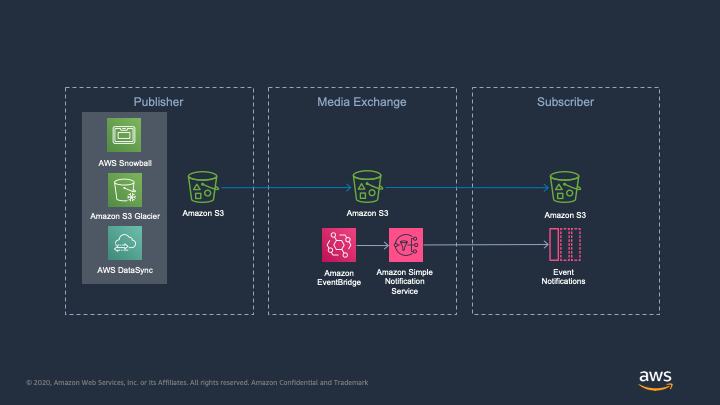

## Introduction
MediaExchange (base) system is the deployment of the shared storage on S3. The rest of the ecosystem builds on top of the base system. 

## Architecture

## Workflow(s)

In a typical content owner workflow, the content owner or studio is on-boarded as a publisher, and the MediaExchange is hosted by the supply chain distributor. The Distributor's MAM/DAM/Ingest service is on-boarded as a subscriber to MediaExchange. In a content distributor workflow, the distributor is on-boarded as a publisher to deliver assets to a partner (e.g. OTT service) and the subscriber is the downstream OTT service.

The subscriber pushes the assets and publishers pull the assets from MediaExchange. This push/pull model also enables simple setup and enforcement of both lifecycle policies and alignment with delivery SLAs.

## Preparation
You will need three AWS accounts to test this effectively (a) publisher, (b) subscriber and (c) MediaExchange. The CloudFormation templates are deployed in (c) MediaExchange account.

## Install (AWS CLI)

The easiest install path is to use the included Makefile. This uses awscli to package and install the CloudFormation templates. It also deploys the products in service catalog so that you can subsequently use service catalog to on-board publishers and subscribers to MediaExchange. If you choose not to use this option, or do not have awscli installed, you can follow the alternative install process.

* Initialize a shell with the necessary credentials to deploy to MediaExchange account. You can do this by adding AWS_ACCESS_KEY_ID, AWS_SECRET_ACCESS_KEY and AWS_SESSION_TOKEN as environment variables or by selecting the appropriate profile by adding AWS_PROFILE environment variable.
* Additionally, you will need to set the environment variable AWS_REGION (the region you want to deploy the MediaExchange). You will also need to use a S3 Bucket in the same region for storing the packaged CloudFormation templates. Set that bucket name to environment variable called CFN_BUCKET.  
* At the command prompt type `make install`. Once complete, it will print out a URL to launch service catalog. Login into your MediaExchange account with that URL to on-board publishers and subscribers. See the on-boarding section for those instructions.

### Alternative Install (NO CLI)

* Login into MediaExchange account and navigate to S3.
* You will need to use a S3 Bucket for storing the packaged CloudFormation templates. Please create a bucket if needed. Make sure to select a region where you are planning to deploy MediaExchange.
* Copy the template files (.yaml) under media-exchange-base/deployment/ to this bucket in a folder media-exchange-on-aws/v1.0.0/ (you may have to create the folders)
* Navigate to services > CloudFormation. Note the region on the top right corner.
  1. Click on Create Stack.
  1. Select "Template is Ready" (default option) in prepare template section and select "Upload a template file" in the specify template section.
  1. Click "choose file" to select servicecatalog.yaml from media-exchange-base/deployment/ folder. Alternatively, you can also use the URL to the templates uploaded to S3 in the previous step.
  1. Click next
  1. Enter a name of the stack eg. mediaexchange-core-prod.
  1. Enter the name of the bucket where CloudFormation templates were copied.
  1. Click next
  1. Accept the capabilities and transforms by checking the boxes and click on create stack.
  1. Wait for the the status to change to create_complete.
  1. Navigate to the outputs tab of the stack and make a note of the ConsoleUrl parameter.
* Follow the on-boarding steps to add publishers and subscribers

### On-boarding

* Login into MediaExchange account using the URL to launch Service Catalog. This URL was printed out on command prompt, and is available in the stack outputs section of the MediaExchange CloudFormation stack.

* The page should list out three products from AWS Solutions Library. Use _publisher_ to on-board an account that needs to push content to MediaExchange and use _subscriber_ to on-board a receiver. Once you have added the publisher and subscriber, establish a transfer link between them my deploying _transfer agreement_.

* _Deploy a publisher_

  1. On the product list screen, click on _publisher_ and then click launch product button.
  1. Enter a stack name eg. mediaexchange-publisher-studio and then click next.
  1. Enter a name for publisher. This is used for identifying the publisher in the MediaExchange and will be used to link up to the subscriber.
  1. Enter the AWS Account Id of the publisher account. See [here](https://docs.aws.amazon.com/IAM/latest/UserGuide/console_account-alias.html#FindingYourAWSId) to find account id and then click next.
  1. (Optional) add tags to resources by specifying them as key-value pairs.
  1. (Optional) enable notification
  1. clink launch.
  1. Once complete, this publisher is going to be listed in the provisioned product list.

* _Deploy a subscriber_

  1. On the product list screen, click on _subscriber_ and then click launch product button.
  1. Enter a stack name eg. mediaexchange-subscriber-ott and then click next.
  1. Enter a name for subscriber. This is used for identifying the publisher in the MediaExchange and will be used to link up to the publisher.
  1. Enter the AWS Account Id of the subscriber account. See [here](https://docs.aws.amazon.com/IAM/latest/UserGuide/console_account-alias.html#FindingYourAWSId) to find account id and then click next.
  1. Enter the Canonical Account ID of the subscriber. See [here](https://docs.aws.amazon.com/general/latest/gr/acct-identifiers.html#FindingCanonicalId) to find Canonical Account Id.
  1. Enter an email address for subscriber. This email is used to send asset availability notifications.
  1. (Optional) add tags to resources by specifying them as key-value pairs.
  1. (Optional) enable notification
  1. clink launch.
  1. Once complete, this subscriber is going to be listed in the provisioned product list.

* _Setup transfer agreement_

  1. On the product list screen, click on _transfer agreement_ and then click launch product button.
  1. Enter a stack name eg. mediaexchange-studio-ott-agreement and then click next.
  1. Enter names for publisher and subscriber.
  1. (Optional) add tags to resources by specifying them as key-value pairs.
  1. (Optional) enable notification
  1. clink launch.
  1. Once complete, this transfer agreement is going to be listed in the provisioned product list.
  1. Share the following information with the publisher over usual communication channels. They will use this configuration information to access MediaExchange.
    * _PublisherOnboardingSummary_
    * _ConsoleUrl_
  1. Share the following information with the subscriber over usual communication channels
    * _SubscriberOnboardingSummary_
    * _ConsoleUrl_

## Notifications  

* The subscriber email should have received and email from AWS SNS requiring them to confirm subscriptions to email messages from MediaExchange.
* Everytime an asset is shared, an email notification is sent out to this address.
* Publishers can send custom event notifications through EventBridge. Please see the tools/push-content.sh for an example.
* Automatic notifications can be disabled by a global configuration parameter in mediaexchange stack if you only want to send custom notifications.

## Sharing assets

* Login into publisher account using the _ConsoleUrl_ from on-boarding information.
* Upload an asset by clicking the "upload" button.
  * Click Add Files, and select an asset from disk.
  * Click Next
  * Click Add Account button next to "Access for other AWS account".
  * In the textbox, enter the value of SUBSCRIBER_CANONICAL_ID from _PublisherOnboardingSummary_
  * Check the "read" box. Click save. This will allow the subscriber account to have read access.
  * Click next
  * Select standard storage class and scroll down to encryption section.
  * Select AWS KMS master-key and click the select a key dropdown.
  * Select Custom KMS ARN and in the text box below enter the value of KMS_KEY_ID from _PublisherOnboardingSummary_ (without the enclosing quotes)
  * Click next and click upload.
* Though it is a multistep process from the console UI, it is essentially a single API call from S3 perspective. It is much simpler if used with programatic workflow integration. Please look at tools/push-content.sh for an example.  

## Receiving assets

* Login into subscriber account using the _ConsoleUrl_ from on-boarding information.
* You will see a list of assets shared with you.
* Select one of the assets and click the download button to download.

## Testing
There are two sample scripts under tools that simulates the workflow supported by Media Exchange. (a) push-content.sh simulates the publisher workflow to share Assets with subscribers and (b) pull-content.sh simulates the subscriber workflow. The agreement stack outputs configuration data to be used in these scripts.

#### Push Content
This is run by publisher. This shares a dummy file, lists assets in the publisher bucket and sends a custom notification.

1. Ensure that you have received the on boarding information (_PublisherOnboardingSummary_ and _ConsoleUrl_) from the MediaExchange administrator.
1. Initialize a shell with the necessary credentials to publisher account. You can do this by adding AWS_ACCESS_KEY_ID, AWS_SECRET_ACCESS_KEY and AWS_SESSION_TOKEN as environment variables or by selecting the appropriate profile by adding AWS_PROFILE environment variable.
1. Save the contents _PublisherOnboardingSummary_ in a file called _publisher.env_ in the tools directory.
1. At the command prompt navigate to tools directory `cd <path to /tools>`.
1. type `./push-content.sh`
1. verify a sample file named `media-exchange-test-object` is present in the bucket by logging into console with _ConsoleUrl_

#### Pull Content
This is run by subscriber. This downloads the file shared by the publisher and lists the directory.

1. Ensure that you have received the on boarding information (_SubscriberOnboardingSummary_ and _ConsoleUrl_) from the MediaExchange administrator.
1. Have you received an email notification from AWS SNS? (it has a JSON blob with information about the assets being shared with you)
1. Initialize a shell with the necessary credentials to subscriber account. You can do this by adding AWS_ACCESS_KEY_ID, AWS_SECRET_ACCESS_KEY and AWS_SESSION_TOKEN as environment variables or by selecting the appropriate profile by adding AWS_PROFILE environment variable.
1. Save the contents _SubscriberOnboardingSummary_ in a file called _subscriber.env_ in the tools directory.
1. At the command prompt navigate to tools directory `cd <path to /tools>`.
1. type `./pull-content.sh`
1. verify a sample file named `media-exchange-test-object` is present in the bucket by logging into console with the _ConsoleUrl_
