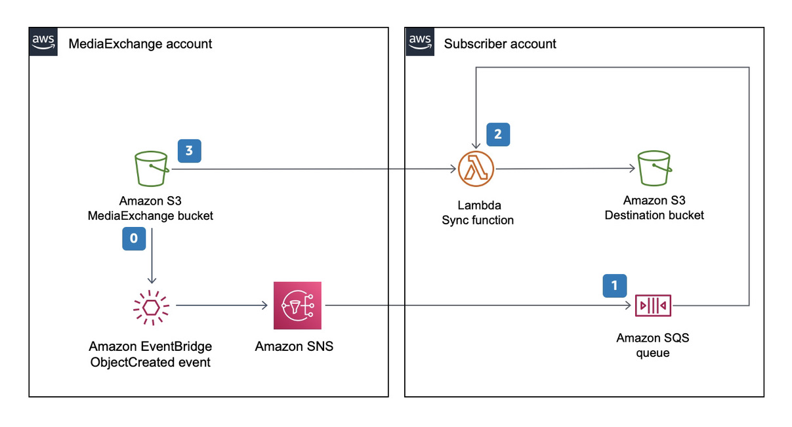

# AutoIngest

## Table of contents

- [Solution Overview](#solution-overview)
- [Architecture Diagram](#architecture-diagram)
- [Customizing the Solution](#customizing-the-solution)
  - [Prerequisites for Customization](#prerequisites-for-customization)
  - [Deploy](#deploy)
  - [Cleanup](#cleanup)
- [Cost](#cost)
- [License](#license)

# Solution Overview

Subscribers to a MediaExchange bucket have the option to automatically ingest to their own bucket by using this component. It automatically moves assets from MediaExchange into a subscriber-owned S3 bucket. This optional component is deployed in the subscriber’s account.

# Architecture Diagram

## Customizing the Solution

### Prerequisites for Customization

- GNU make
- Docker desktop
- Node
- [AWS CDK] (https://docs.aws.amazon.com/cdk/v2/guide/getting_started.html)
- [AWS CLI](https://docs.aws.amazon.com/cli/latest/userguide/cli-chap-install.html)
- [AWS SAM CLI](https://docs.aws.amazon.com/serverless-application-model/latest/developerguide/serverless-sam-cli-install.html)

### Deploy

- Initialize a shell with AWS credentials to deploy to target (subscriber) account. You can do this by adding AWS_ACCESS_KEY_ID, AWS_SECRET_ACCESS_KEY and AWS_SESSION_TOKEN as environment variables or by selecting the appropriate profile by adding AWS_PROFILE environment variable.
- Run the build script in the deployment folder of the root directory to generate template files for this solution (or use existing ones in development directory of this function)
- At the command prompt type `make install`.
- follow the on-screen instructions for configuration parameters.
  - Specify the Source bucket name.
  - Specify the destination bucket name.
  - Specify the SNS topic Arn from subscriber on boarding summary.
  - Specify the destination bucket prefix.

### Cleanup

- Initialize a shell with AWS credentials to deploy to target (subscriber) account. You can do this by adding AWS_ACCESS_KEY_ID, AWS_SECRET_ACCESS_KEY and AWS_SESSION_TOKEN as environment variables or by selecting the appropriate profile by adding AWS_PROFILE environment variable.
- At the command prompt type `make clean`.

## Cost

- S3 API pricing for GET / PUT. See [here](https://aws.amazon.com/s3/pricing/).
- There is no cost for egress in the same region.
- AWS Lambda pricing. See [here](https://aws.amazon.com/lambda/pricing/)

# License

See license [here](https://github.com/aws-solutions/media-exchange-on-aws/blob/main/LICENSE.txt)
