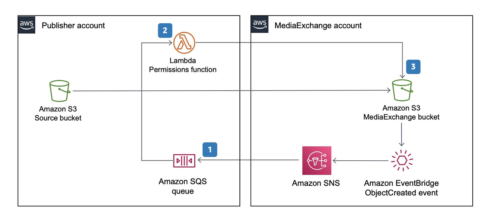

# AutoACL

This optional utility is deployed in the publisher’s account so that existing Amazon S3 workflows can adopt to MediaExchange-based transfer workflows without making code changes. The existing workflows treat the MediaExchange S3 bucket like any other S3 bucket with write permissions. The Auto ACL utility automates permissions and asset sharing from the MediaExchange S3 bucket so that objects copied into the MediaExchange S3 bucket have their permissions set for the target subscriber.




### Simplified Asset sharing

```
$ aws s3 cp <filename> s3://<bucket name>/
```

## Prerequisites
* GNU make
* Install docker desktop
* Install and configure [AWS CLI](https://docs.aws.amazon.com/cli/latest/userguide/cli-chap-install.html)
* Install [AWS SAM CLI](https://docs.aws.amazon.com/serverless-application-model/latest/developerguide/serverless-sam-cli-install.html)


### Install
* Initialize a shell with the necessary credentials to deploy to target (publisher / subscriber) account. You can do this by adding AWS_ACCESS_KEY_ID, AWS_SECRET_ACCESS_KEY and AWS_SESSION_TOKEN as environment variables or by selecting the appropriate profile by adding AWS_PROFILE environment variable.
* Deploy AutoIngest
  * At the command prompt type `make install`.
  * follow the on-screen instructions for configuration parameters.
    * Specify the SNS topic Arn, Subscriber Canonical Id, Media Exchange Bucket Name, and EventBus from publisher on boarding summary.


### Pricing

1. S3 API pricing for GET / PUT. See [here](https://aws.amazon.com/s3/pricing/).
1. There is no cost for egress in the same region.
1. AWS Lambda pricing. See [here](https://aws.amazon.com/lambda/pricing/)

### Cleanup

* Initialize a shell with the necessary credentials to the account where you have deployed this. You can do this by adding AWS_ACCESS_KEY_ID, AWS_SECRET_ACCESS_KEY and AWS_SESSION_TOKEN as environment variables or by selecting the appropriate profile by adding AWS_PROFILE environment variable.
* Navigate to MediaExchnageOnAWS/tools/autoacl directory.
* At the command prompt type `make clean`.
