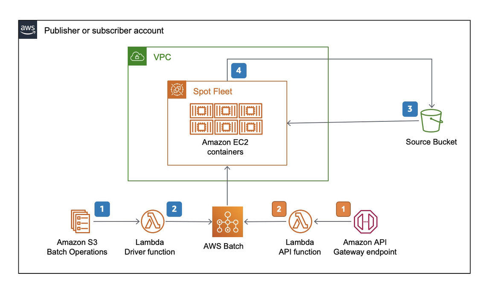

# Fixity

## Table of contents

- [Solution Overview](#solution-overview)
- [Architecture Diagram](#architecture-diagram)
- [Customizing the Solution](#customizing-the-solution)
  - [Prerequisites for Customization](#prerequisites-for-customization)
  - [Deploy](#deploy)
  - [Cleanup](#cleanup)
- [Usage](#usage)
- [Performance](#performance)
- [Cost](#cost)
- [License](#license)

<a name="solution-overview"></a>
# Solution Overview
This optional utility computes checksums at scale by publishers (at source) or by subscribers (at destination) to ensure file integrity. It uses AWS Batch and Amazon Elastic Compute Cloud (Amazon EC2) Spot Instances to orchestrate the computation infrastructure. It calculates checksums by streaming the objects directly from Amazon S3, so that there is no requirement of local instance storage.

<a name="architecture-diagram"></a>
# Architecture Diagram


This utility reads the objects from S3 and computes md5, sha1, xxhash and xx64hash. The resultant checksums are stored as Tags on the source S3 objects. This process is executed in containers managed by AWS Batch.

It offers two ways to initiate the checksums.

In the first method, it uses S3 batch operations as frontend. S3 Batch operations works with a CSV formatted inventory list file. You can use S3 [inventory reports](https://docs.aws.amazon.com/AmazonS3/latest/userguide/storage-inventory.html) if you already have one. Otherwise, you can generate an inventory list by utilizing the included scripts/generate_inventory.sh script. Please note that the script works for hundreds of files. If you have thousands of objects in the bucket, inventory reports are the way to go. S3 Batch Jobs invoke a lambda function that performs a few basic checks before handing off the actual fixity operation to a script. This script runs in containers in AWS Batch and Fargate for files smaller than 10GB. If the files are larger than 10GB it runs on Ec2 SPOT which opens up use of high performance and larger instance types. It produces the following checksums, as store them as custom tags with the s3 objects.

* md5sum
* sha1sum
* xxhsum

This process works well if you have lots of objects that needs checksumming.

There is also an API that can be used to invoke the checksumming process one object at a time. The API takes a bucketname and key as parameters. It uses the same underlying AWS Batch infrastructure to compute the checksums.

<a name="customizing-the-solution"></a>
## Customizing the Solution

<a name="prerequisites-for-customization"></a>
### Prerequisites for Customization
* GNU make
* Docker desktop
* [AWS CLI](https://docs.aws.amazon.com/cli/latest/userguide/cli-chap-install.html)
* [AWS SAM CLI](https://docs.aws.amazon.com/serverless-application-model/latest/developerguide/serverless-sam-cli-install.html)

<a name="deploy"></a>
### Deploy

* Initialize a shell with AWS credentials to deploy to target (subscriber) account. You can do this by adding AWS_ACCESS_KEY_ID, AWS_SECRET_ACCESS_KEY and AWS_SESSION_TOKEN as environment variables or by selecting the appropriate profile by adding AWS_PROFILE environment variable.
* At the command prompt type `make install`.
* follow the on-screen instructions for configuration parameters.

<a name="cleanup"></a>
### Cleanup

* Initialize a shell with AWS credentials to deploy to target (subscriber) account. You can do this by adding AWS_ACCESS_KEY_ID, AWS_SECRET_ACCESS_KEY and AWS_SESSION_TOKEN as environment variables or by selecting the appropriate profile by adding AWS_PROFILE environment variable.
* Navigate to MediaExchnageOnAWS/tools/fixity directory.
* At the command prompt type `make outputs`. And make a note of the value of _FlowLogBucketName_.
* At the command prompt type `make clean`.
* This process leaves a VPC Flow Log Bucket. This bucket needs to be cleaned up manually. You noted _FlowLogBucketName_ in the first step.
* Run the following command to remove the bucket and its contents.
  ```
  $ aws s3 rm s3://<log bucket name> --recursive
  $ aws s3 rb s3://<log bucket name>
  ```

<a name="usage"></a>
## Usage

1. Sign in to your AWS account and navigate to S3.
1. On the left menu, select batch operations.
1. Choose Create Job:
  * Select the region where you have installed the fixity.
  *  For the manifest, select CSV or S3 inventory report based on what you prepared.
  *  Choose Next.
  *  Select Invoke AWS lambda function.
  *  In the section below, select Choose from functions in your account and select the lambda function ending with fixity.
  *  Choose Next.
  *  Under Additional options, enter an appropriate description.
  *  For the completion report, select Failed tasks only and select a destination s3 bucket.
  *  Under the permissions section, select choose from existing IAM roles, and select the IAM role ending in fixity_role in the same region.
  *  Choose Next.
  *  Review the Job in the last page and choose Create job.
1. Once the Job is created, it goes from new to awaiting user confirmation state. Choose Run job when ready.
1. The S3 Batch job invokes the lambda function that drops copy jobs into an ECS batch job queue. Tasks from this queue are executed in FARGATE.

<a name="performance"></a>
## Performance

Expected performance per object:

* 16 seconds for 1 GB
* 23 seconds for 5 GB
* 43 seconds for 10 GB
* 2 minutes for 50 GB
* 4 minutes for 100 GB
* 20 minutes for 500 GB
* 39 minutes for 1 TB

Out of the box, it can run 256 checksums in parallel.

<a name="cost"></a>
## Cost

1. S3 API pricing for GET / PUT. See [here](https://aws.amazon.com/s3/pricing/).
1. S3 Batch pricing See [here](https://aws.amazon.com/s3/pricing/)
1. There is no cost for egress in the same region.
1. There is no additional charge for AWS Batch.
1. AWS Lambda pricing. See [here](https://aws.amazon.com/lambda/pricing/)
1. AWS Fargate SPOT pricing. See [here](https://aws.amazon.com/fargate/pricing/)


<a name="license"></a>
# License
See license [here](https://github.com/aws-solutions/media-exchange-on-aws/blob/main/LICENSE.txt)
