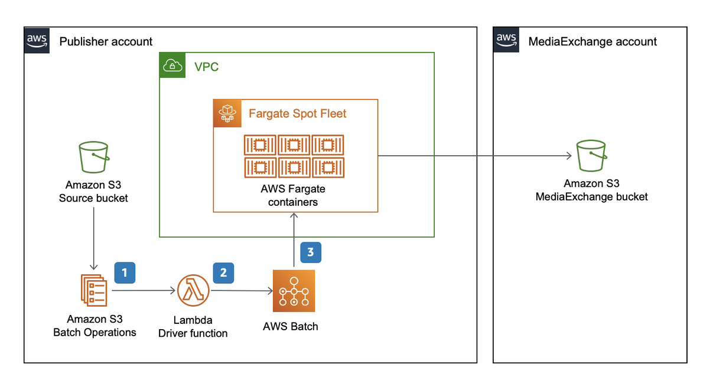

# MediaSync

## Table of contents

- [Solution Overview](#solution-overview)
- [Architecture Diagram](#architecture-diagram)
- [Customizing the Solution](#customizing-the-solution)
  - [Prerequisites for Customization](#prerequisites-for-customization)
  - [Deploy](#deploy)
  - [Cleanup](#cleanup)
- [Usage](#usage)
- [Performance](#performance)
- [Cost](#cost)
- [License](#license)

<a name="solution-overview"></a>
# Solution Overview
This optional utility moves assets between Amazon S3 buckets. When you deploy this, it enables a new toolset in the AWS Management Console that helps move large (100s of GBs) files or hundreds of thousands of small files. The MediaSync utility scales up by running the copy operation in parallel to thousands of concurrent processes. It can handle file sizes up to 5 TB, is resilient, and cost effective. The uses AWS Fargate Spot for its compute environment.

<a name="architecture-diagram"></a>
# Architecture Diagram


MediaSync uses S3 batch operations. S3 Batch operations works with a CSV formatted inventory list file. You can use S3 inventory reports if you already have one. Otherwise, you can generate an inventory list by utilizing the included scripts/generate_inventory.sh script. Please note that the script works best if there are less than one hundred thousand objects in the source bucket. If you have more objects in the bucket, inventory reports are the way to go.

S3 Batch Jobs invoke an AWS Lambda function that performs a few basic checks before handing off the actual copy operation to a script. This script runs in containers in AWS Batch and AWS Fargate. The copy operation itself uses S3 server-side copy, so the containers themselves do not handle the actual bytes. If the object is small (<500MB) the copy happens in Lambda.


<a name="customizing-the-solution"></a>
## Customizing the Solution

<a name="prerequisites-for-customization"></a>
### Prerequisites for Customization
* GNU make
* Docker desktop
* [AWS CLI](https://docs.aws.amazon.com/cli/latest/userguide/cli-chap-install.html)
* [AWS SAM CLI](https://docs.aws.amazon.com/serverless-application-model/latest/developerguide/serverless-sam-cli-install.html)

<a name="deploy"></a>
### Deploy

* Initialize a shell with the necessary credentials to deploy to target (publisher / subscriber) account. You can do this by adding AWS_ACCESS_KEY_ID, AWS_SECRET_ACCESS_KEY and AWS_SESSION_TOKEN as environment variables or by selecting the appropriate profile by adding AWS_PROFILE environment variable.
* (optional) Build and publish custom container
  * At the command prompt type `make publish`. This publishes the custom container to a private ECR repository.
  * Follow the on-screen instructions for configuration parameters.

* Deploy MediaSync
  * At the command prompt type `make install`.
  * Follow the on-screen instructions for configuration parameters.
    * If you have built a custom image in the previous step, specify that in the ImageName parameter. Otherwise leave default as amazon/aws-cli.
    * Specify the destination bucket name.

<a name="cleanup"></a>
### Cleanup

* Initialize a shell with the necessary credentials to the account where you have deployed this. You can do this by adding AWS_ACCESS_KEY_ID, AWS_SECRET_ACCESS_KEY and AWS_SESSION_TOKEN as environment variables or by selecting the appropriate profile by adding AWS_PROFILE environment variable.

* Navigate to MediaExchangeOnAWS/tools/mediasync directory.
* Remove MediaSync
  * Navigate to MediaExchnageOnAWS/tools/mediasync directory.
  * At the command prompt type `make outputs`. And make a note of the value of _FlowLogBucketName_.
  * At the command prompt type `make clean`.
  * This process leaves a VPC Flow Log Bucket. This bucket needs to be cleaned up manually. You noted _FlowLogBucketName_ in the first step.
  * Run the following command to remove the bucket and its contents.
    ```
    $ aws s3 rm s3://<log bucket name> --recursive
    $ aws s3 rb s3://<log bucket name>
    ```
* (Optional) Remove custom container images, if you choose to use them.
  *  At the command prompt type `make clean-repository mediasync-repository-delete-stack`.

<a name="usage"></a>
## Usage

1. Sign in to AWS account and navigate to S3.
1. On the left menu, select Batch operations.
1. Choose Create Job:
  * Select the Region where you have installed the MediaSync.
  * For the manifest, select CSV or S3 inventory report based on what you prepared.
  * Choose Next.
  * Select Invoke AWS Lambda function.
  * In the section below, select Choose from functions in your account and select the Lambda function starting with MediaSync.
  * Choose Next.
  * Under Additional options, enter an appropriate description.
  * For the completion report, select Failed tasks only and select a destination S3 bucket.
  * Under Permissions, select Choose from existing IAM roles, and select the IAM role starting with MediaSync in the same Region.
  * Choose Next
  * Review the Job in the last page and choose Create job.
1. Once the Job is created, it goes from new to awaiting user confirmation state. Choose Run job when ready.
1. The S3 Batch job invokes the Lambda function that drops copy jobs into an ECS batch job queue. Tasks from this queue are executed in FARGATE.

There is a helper script available in scripts/run_copy_job.sh that automates all of these steps. The script takes inventory bucket name and key as inputs.

<a name="performance"></a>
## Performance

Single object performance is

* 24 seconds for 1 GB
* 32 seconds for 5 GB
* 40 seconds for 10 GB
* 2 minute for 100 GB
* 7 minutes 30 seconds for 500 GB
* 11 minutes for 1TB
* 27 minutes for 5TB

It runs many of these transfers in parallel. It takes about three hours to copy 1PB of assets between two buckets in the same region.

<a name="cost"></a>
## Cost

1. S3 API pricing for GET / PUT. See [here](https://aws.amazon.com/s3/pricing/).
1. S3 Batch pricing See [here](https://aws.amazon.com/s3/pricing/)
1. There is no cost for egress in the same Region.
1. There is no additional charge for AWS Batch.
1. AWS Lambda pricing. See [here](https://aws.amazon.com/lambda/pricing/)
1. AWS Fargate SPOT pricing. See [here](https://aws.amazon.com/fargate/pricing/)


<a name="license"></a>
# License
See license [here](https://github.com/aws-solutions/media-exchange-on-aws/blob/master/LICENSE.txt)
